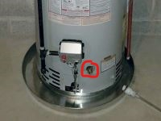

# Hot Water Heater Installation
***

## **Warning:**
- **Vapors from flammable liquids will explode and catch fire causing death or severe burns**
- **Do not use or store flammable products such as gasoline, solvents or adhesives in the same room or area near th water heater**

### Keep Flammable Products:
1. **Far away from heater**
2. **In approved containers**
3. **Tightly closed and out of children's reach**

### Water heater has a main burner and pilot flame. The pilot flame:
1. **Is on all the time and**
2. **And will ignite flammable vapors**

### Vapors
1. **Cannot be seen**
2. **Are heavier than air**
3. **Go a long way on the floor and**
4. **Can be carried from other rooms to the pilot flame by air currents**

***

## Materials
- Pipe Wrench and/or channel locks
- Water Pump and/or hose
- Pipe Cutters
- Copper Pipe
- Copper Pipe fittngs
- Black Iron Pipe
- Pipe Dope
- Teflon Tape

***

# Procedure
1. Shut off cold water valve
2. Locate drainage valve at bottom of heater
   - Attach pump and/or hose to drain water from tank

3.
